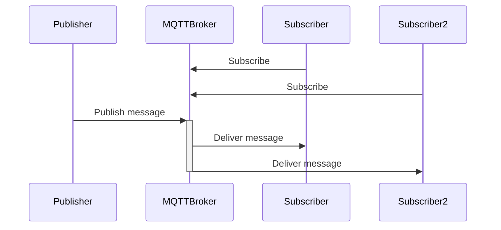
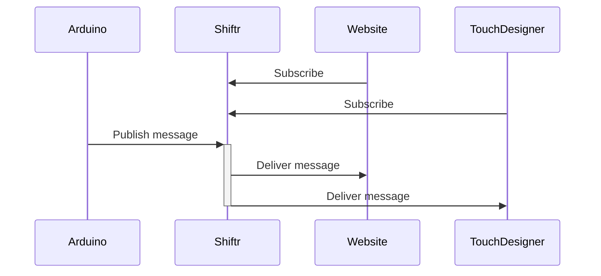

# MQTT

Make _things_ talk with each other

<time datetime="2024-03-20">_20th March 2024_</time>


---
level: 2
transition: slide-left
layout: center
---

# Today

<Toc maxDepth="1"></Toc>


---
layout: fact
title: What is MQTT?
---

<em class="text-5xl">
MQTT [...] is designed as an extremely lightweight <code class="underline underline-[#1BAA54]">publish/subscribe</code> messaging transport that is ideal for connecting remote devices with a small code footprint [...]
</em>

<cite>https://mqtt.org</cite>


---
level: 2
title: sequence diagram
layout: fact
preload: true
clicks: 1
---

<span v-click.hide="1">

</span>

<span v-click="1">

</span>

<div class="animated-dot one"></div>
<div class="animated-dot two"></div>

<style>
  .slidev-vclick-target {
    transition: all 500ms ease;
  }

  .slidev-vclick-hidden {
    transform: scale(0);
    display: none;
  }

  @keyframes moveDotOne {
    0% {
      transform: translateX(127px) translateY(-220px);
      opacity: 1;
    }
    30% {
      transform: translateX(327px) translateY(-220px);
      opacity: 1;
    }
    60% {
      transform: translateX(327px) translateY(-166px);
      opacity: 1;
    }
    90% {
      transform: translateX(527px) translateY(-166px);
      opacity: 1;
    }
    95% {
      transform: translateX(527px) translateY(-166px);
      opacity: 0;
    }
    100% {
      transform: translateX(127px) translateY(-166px);
      opacity: 0;
    }
  }

  @keyframes moveDotTwo {
    0% {
      transform: translateX(127px) translateY(-220px);
      opacity: 1;
    }
    30% {
      transform: translateX(327px) translateY(-220px);
      opacity: 1;
    }
    60% {
      transform: translateX(327px) translateY(-111px);
      opacity: 1;
    }
    90% {
      transform: translateX(727px) translateY(-111px);
      opacity: 1;
    }
    95% {
      transform: translateX(727px) translateY(-111px);
      opacity: 0;
    }
    100% {
      transform: translateX(127px) translateY(-111px);
      opacity: 0;
    }
  }

  .animated-dot {
    content: ' ';
    width: 15px;
    height: 15px;
    background-color: #1BAA54;
    border-radius: 50%;
    position: absolute;
    animation-duration: 2s;
    animation-iteration-count: infinite;
  }

  .animated-dot.one {
    animation-name: moveDotOne;
  }

  .animated-dot.two {
    animation-name: moveDotTwo;
  }
</style>


---
title: Demo using shiftr.io
image: ./shiftr.png
layout: image
---

<div class="flex items-end justify-center h-full text-4xl">
  <a href="https://mdd-mqtt-example.cloud.shiftr.io">mdd-mqtt-example.cloud.shiftr.io</a>
</div>

---
level: 2
title: MQTT Explorer
image: ./mqtt-explorer.png
layout: image
transition: slide-left
---

<div class="flex items-end justify-center h-full text-4xl">
  <a href="https://mqtt-explorer.com/">mqtt-explorer.com</a>
</div>

---
layout: cover
transition: slide-up
---

# Challenge

Make two _things_ talk to each other using MQTT

https://shiftr.io/docs/manuals <br/>
https://wiki.mdd-tardis.net/index.php/IoT_boilerplate

---
title: Arduino & HTML
level: 2
layout: two-cols
---


<template v-slot:default>

**Arduino**

```cpp
#include <WiFi.h>
#include <PubSubClient.h>

WiFiClient net;
PubSubClient client(net);
client.setServer("<server>", "<port>");
client.setCallback(onMessageArrived)

const char* id = String(random(0xffff), HEX);
const char* topic = "<topic>";

void setup() {
  Serial.begin(9600);
  WiFi.begin("<ssid>", "<pass>");
  while (WiFi.status() != WL_CONNECTED) { delay(500); }
  client.connect(id, "<user>", "<pass>");
  client.subscribe(topic);
  client.publish(topic, "Hello from " + id);
}

void loop() { client.loop(); }

void onMessageArrived(char *topic, byte *message) {
  Serial.println("received: " + String((char*)message));
}
```

</template>
<template v-slot:right>

**HTML**

```html 
<body>
<script
src="https://unpkg.com/paho-mqtt@1.0.2/mqttws31.js"></script>

<script>
  const id = Math.random().toString(36).substring(7);
  const topic = "<topic>";
  const client = new Paho.MQTT.Client("<server>", "<port>", id)
  
  client.onMessageArrived = (message) => {
    console.log("received: " + message.payloadString);
  }

  client.connect({
    userName: "<user>",
    password: "<pass>",
    onSuccess: () => {
      client.subscribe(topic);
      client.send(topic, "Hello from " + id);
    },
    useSSL: window.location.protocol === "https:",
    onFailure: console.log,
  })
</script>
</body>
```
</template>

<style>
  .slidev-layout {
    padding: 0.5rem;
    grid-template-columns: 1fr 1fr;
    gap: 1rem;
  }
</style>

---
title: Examples
layout: cover
transition: slide-up
---

# Examples

---
level: 2
title: Cursor
layout: two-cols
---

<template v-slot:default>

```html
<body>
<script
src="https://unpkg.com/paho-mqtt@1.0.2/mqttws31.js"></script>

<script>
  const id = Math.random().toString(36).substring(7);
  const topic = "mouse/" + id;
  const server = "broker.hivemq.com";
  const client = new Paho.MQTT.Client(server, 9001, id);
  
  client.onMessageArrived = (message) => {
    console.log("received: " + message.payloadString);
  }

  client.connect({
    // userName: "<user>",
    // password: "<pass>",
    onSuccess: () => {
      client.subscribe("mouse/+");
      client.send(topic, "Hello from " + id);
    },
    useSSL: window.location.protocol === "https:",
    onFailure: console.log,
  })
</script>
</body>
```

</template>
<template v-slot:right>

```html
<div>asd</div>
```

</template>

<style>
  .slidev-layout {
    padding: 0.5rem;
    grid-template-columns: 1fr 1fr;
    gap: 0.25rem;
  }
</style>