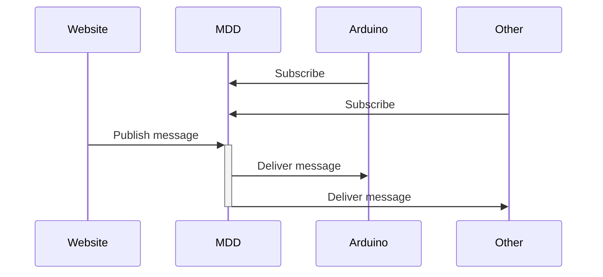

# MQTT

Make _things_ talk with each other

<time datetime="2024-03-20">_20th March 2024_</time>


---
level: 2
transition: slide-left
layout: center
---

# Today

<Toc maxDepth="1"></Toc>


---
layout: fact
title: What is MQTT?
---

<em class="text-5xl">
MQTT [...] is designed as an extremely lightweight <code class="underline underline-[#193F52]">publish/subscribe</code> messaging transport that is ideal for connecting remote devices with a small code footprint [...]
</em>

<cite>https://mqtt.org</cite>


---
level: 2
title: sequence diagram pub/sub
layout: fact
preload: true
transition: fade
---


<div class="animated-dot one"></div>
<div class="animated-dot two"></div>

<style>
  .slidev-vclick-target {
    transition: all 500ms ease;
  }

  .slidev-vclick-hidden {
    transform: scale(0);
    display: none;
  }

  @keyframes moveDotOne {
    0% {
      transform: translateX(127px) translateY(-220px);
      opacity: 1;
    }
    30% {
      transform: translateX(327px) translateY(-220px);
      opacity: 1;
    }
    60% {
      transform: translateX(327px) translateY(-166px);
      opacity: 1;
    }
    90% {
      transform: translateX(527px) translateY(-166px);
      opacity: 1;
    }
    95% {
      transform: translateX(527px) translateY(-166px);
      opacity: 0;
    }
    100% {
      transform: translateX(127px) translateY(-166px);
      opacity: 0;
    }
  }

  @keyframes moveDotTwo {
    0% {
      transform: translateX(127px) translateY(-220px);
      opacity: 1;
    }
    30% {
      transform: translateX(327px) translateY(-220px);
      opacity: 1;
    }
    60% {
      transform: translateX(327px) translateY(-111px);
      opacity: 1;
    }
    90% {
      transform: translateX(727px) translateY(-111px);
      opacity: 1;
    }
    95% {
      transform: translateX(727px) translateY(-111px);
      opacity: 0;
    }
    100% {
      transform: translateX(127px) translateY(-111px);
      opacity: 0;
    }
  }

  .animated-dot {
    content: ' ';
    width: 15px;
    height: 15px;
    background-color: #D5EEF4;
    border: 2px solid #193F52;
    border-radius: 50%;
    position: absolute;
    animation-duration: 2s;
    animation-iteration-count: infinite;
  }

  .animated-dot.one {
    animation-name: moveDotOne;
  }

  .animated-dot.two {
    animation-name: moveDotTwo;
  }
</style>

---
level: 2
title: sequence diagram arduino
layout: fact
preload: true
---



<div class="animated-dot one"></div>
<div class="animated-dot two"></div>

<style>
  .slidev-vclick-target {
    transition: all 500ms ease;
  }

  .slidev-vclick-hidden {
    transform: scale(0);
    display: none;
  }

  @keyframes moveDotOne {
    0% {
      transform: translateX(127px) translateY(-220px);
      opacity: 1;
    }
    30% {
      transform: translateX(327px) translateY(-220px);
      opacity: 1;
    }
    60% {
      transform: translateX(327px) translateY(-166px);
      opacity: 1;
    }
    90% {
      transform: translateX(527px) translateY(-166px);
      opacity: 1;
    }
    95% {
      transform: translateX(527px) translateY(-166px);
      opacity: 0;
    }
    100% {
      transform: translateX(127px) translateY(-166px);
      opacity: 0;
    }
  }

  @keyframes moveDotTwo {
    0% {
      transform: translateX(127px) translateY(-220px);
      opacity: 1;
    }
    30% {
      transform: translateX(327px) translateY(-220px);
      opacity: 1;
    }
    60% {
      transform: translateX(327px) translateY(-111px);
      opacity: 1;
    }
    90% {
      transform: translateX(727px) translateY(-111px);
      opacity: 1;
    }
    95% {
      transform: translateX(727px) translateY(-111px);
      opacity: 0;
    }
    100% {
      transform: translateX(127px) translateY(-111px);
      opacity: 0;
    }
  }

  .animated-dot {
    content: ' ';
    width: 15px;
    height: 15px;
    background-color: #D5EEF4;
    border: 2px solid #193F52;
    border-radius: 50%;
    position: absolute;
    animation-duration: 2s;
    animation-iteration-count: infinite;
  }

  .animated-dot.one {
    animation-name: moveDotOne;
  }

  .animated-dot.two {
    animation-name: moveDotTwo;
  }
</style>


---
title: Demo using mdd-tardis.net
image: ./mqtt-visualization.png
layout: image
---

<div class="flex items-end justify-center h-full text-4xl">
  <a href="http://37.97.203.138:8081">http://37.97.203.138:8081</a>
</div>

---
level: 2
title: MQTT Explorer
image: ./mqtt-explorer.png
layout: image
---

<div class="flex items-end justify-center h-full text-4xl">
  <a href="https://mqtt-explorer.com">https://mqtt-explorer.com</a>
</div>

---
title: Topics
layout: fact
---

<div class="text-7xl">MDD<span class="text-[#193F52]">/</span>class<span class="text-[#193F52]">/</span>2024</div>

<arrow x1="390" y1="410" x2="390" y2="320" color="#193F52" width="2" />
<arrow x1="580" y1="410" x2="580" y2="320" color="#193F52" width="2" />

<arrow x1="280" y1="130" x2="280" y2="230" color="#fff" width="2" />
<arrow x1="490" y1="130" x2="490" y2="230" color="#fff" width="2" />
<arrow x1="690" y1="130" x2="690" y2="230" color="#fff" width="2" />

<div class="text-3xl absolute top-15 left-105 italic">topic level</div>
<div class="text-3xl absolute top-110 left-88 italic text-[#193F52]">topic level separator</div>


---
level: 2
title: MQTT Explorer
image: ./mqtt-topic.png
layout: image
---

<div class="flex items-end justify-center h-full text-4xl">
  <a href="https://public.cloud.shiftr.io/">public.cloud.shiftr.io</a>
</div>

---
title: Examples
layout: cover
---

# Examples
https://github.com/xiduzo/presentation-mqtt/tree/main/examples

---
title: Arduino & HTML
level: 2
layout: two-cols
---


<template v-slot:default>

**Arduino***

```cpp
#include <WiFi.h>
#include <MQTT.h>
WiFiClient net;
MQTTClient client;

void setup() {
  Serial.begin(115200);
  pinMode(LED_BUILTIN, OUTPUT);
  WiFi.begin("iotroam", "loislane");
  client.begin("37.97.203.138", net);
  client.onMessage(messageReceived);
  connect();
}
void connect() {
  digitalWrite(LED_BUILTIN, LOW); // Show connecting
  while (WiFi.status() != WL_CONNECTED) {delay(100);}
  while (!client.connect("id", "mdd", "loislane")) {delay(100);}
  digitalWrite(LED_BUILTIN, HIGH); // Show connected
  client.subscribe("topic");
  client.publish("topic", "Hello from arduino");
}
void messageReceived(String &topic, String &message) {
  Serial.println(topic + ": " + message);
}
void loop() {
  client.loop(); delay(10);
  if (!client.connected()) { connect(); }
}
```

</template>
<template v-slot:right>

**HTML***

```html
<body>
  <script src="https://unpkg.com/mqtt/dist/mqtt.js"></script>
  <script>
    const isSecure = window.location.protocol === "https:";
    const protocol = isSecure ? "wss" : "ws";
    const port = isSecure ? 9001 : 9002;
    const connection = "://mdd:loislane@37.97.203.138:";
    const client = mqtt.connect(protocol + connection + port);

    client.on("message", messageReceived);
    client.on("connect", function() {
      println("connected!");
      client.subscribe("topic");
      client.publish("topic", "Hello from HTML");
    });

    function messageReceived(topic, message) {
      println(topic + ": " + message);
    }
    function println(message) {
      const p = document.createElement("p");
      p.textContent = message;
      document.querySelector("body").append(p);
    }
  </script>
</body>
```

<span class="text-xs">
* Both examples are based on this starter code
</span>

</template>

<style>
  .slidev-layout {
    padding: 0.25rem 0.5rem;
    grid-template-columns: 1fr 1fr;
    gap: 0.5rem;
  }

  .slidev-layout p {
   margin: 0.25rem;
  }

  code {
    font-size: 0.8em;
  }
</style>

---
level: 2
title: Cursor
layout: center
---

**Collaboration cursor**

<a href="https://xiduzo.github.io/presentation-mqtt/cursor" class="text-4xl">
  xiduzo.github.io/presentation-mqtt/cursor
</a>

---
level: 2
title: Lights
layout: center
---

**Smart lights**
<!-- This will be a website controlling an arduino LED and arduino light sensor making background -->
<a href="https://xiduzo.github.io/presentation-mqtt/light" class="text-4xl">
  xiduzo.github.io/presentation-mqtt/light
</a>

---
layout: cover
---

# DIY

Make two _things_ talk to each other using MQTT

https://shiftr.io/docs/manuals <br/>
https://wiki.mdd-tardis.net/index.php/IoT_boilerplate

---
layout: cover
---

# Advice

1. Use only HTML, CSS, and JavaScript
2. Split the workload, one person will be _publishing_ and the other _subscribing_